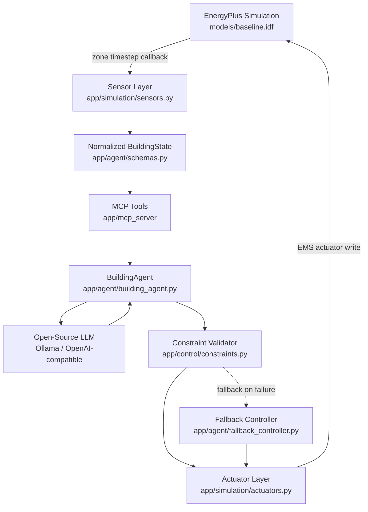

# Architecture — Eco-Loop Building Agents

## 1. Overview

Eco-Loop closes the loop between a physics-based building simulation
(EnergyPlus) and an autonomous LLM agent that reasons over live sensor data
and issues HVAC setpoint decisions, every control interval, with no human
in the loop.

## 2. Data Flow

1. **EnergyPlus** advances one zone timestep and fires a Python API
   callback (`callback_begin_zone_timestep_after_init_heat_balance`)
   registered by `EnergyPlusRunner`.
2. **Sensors** (`app/simulation/sensors.py`) read the current zone/outdoor
   temperature, occupancy, HVAC/total electricity, PMV, humidity, and
   current setpoints via `api.exchange.get_variable_value(...)`, and
   assemble a validated `BuildingState` (Pydantic).
3. Every `CONTROL_INTERVAL_MINUTES` of simulated time, the runner invokes
   the **decision callback**, which delegates to `BuildingAgent.decide()`.
4. `BuildingAgent` pushes the new state into the **MCP server**
   (`push_building_state`) and gathers context by calling several
   **real MCP tools** over stdio — `get_comfort_metrics`,
   `get_energy_consumption`, `get_occupancy`, `get_current_setpoints`,
   `get_recent_history`, `get_simulation_errors` — each a genuine
   request/response over the Model Context Protocol, not a mocked
   function call.
5. The agent builds a prompt (`app/agent/prompts.py`) from that context
   and calls the **open-source LLM** (`app/agent/llm_client.py`, an
   OpenAI-compatible client pointed at Ollama by default).
6. The LLM's JSON response is validated against `AgentDecision`
   (Pydantic). Malformed JSON triggers one retry with an error hint;
   repeated failure, an unreachable LLM, or a detected oscillation
   pattern falls back to the deterministic `fallback_controller`.
7. The (validated-schema) decision is submitted through the
   `apply_control_action` MCP tool, which routes it through
   `app/control/constraints.py::validate_action` — the single
   deterministic gate every action must pass before reaching EnergyPlus.
8. The **actuator layer** writes the clamped setpoints into two
   EMS-actuatable `Schedule:Constant` objects
   (`CLG_SETPOINT_SCHED`, `HTG_SETPOINT_SCHED`) using
   `get_actuator_handle` / `set_actuator_value`.
9. EnergyPlus advances; the loop repeats automatically until the
   `RunPeriod` ends.

## 3. Tool-Calling Architecture (MCP)

`app/mcp_server/server.py` exposes 11 tools via the official `mcp` Python
SDK's `FastMCP` high-level API, running as a **real stdio subprocess**
(`python -m app.mcp_server.server`), spawned and supervised by
`BuildingAgent` for the whole simulation run. `app/mcp_server/tools.py`
holds the actual logic (a thread-safe `BuildingStateStore`); the server
module is a thin `@mcp.tool()` wrapper around it, so the exact same
functions back both the MCP transport and any local unit tests.

| Tool | Purpose |
|---|---|
| `push_building_state` | Ingest the latest EnergyPlus-derived state (bridge tool) |
| `get_building_state` | Full current state |
| `get_zone_temperature` | Zone + outdoor temperature |
| `get_energy_consumption` | HVAC / total electric power, loads |
| `get_comfort_metrics` | PMV, humidity, comfort-band flags |
| `get_occupancy` | Occupant count + occupied flag |
| `get_current_setpoints` | Active cooling/heating setpoints |
| `get_simulation_errors` | Recorded EnergyPlus/tool errors |
| `get_recent_history` | Last N states (agent memory) |
| `set_cooling_setpoint` / `set_heating_setpoint` | Single-value proposals (validated) |
| `apply_control_action` | Full structured decision (validated + logged) |

## 4. Prompt Strategy

`app/agent/prompts.py` builds a system prompt encoding the agent's
priority order (comfort/safety first, then energy, peak demand, gradual
changes, hard constraints, learning from history — see
`docs/SYSTEM_REPORT.md`), and a per-step user prompt containing: current
state, recent history (up to 8 steps), recent decisions, and the live
constraint bounds pulled from `.env` (`constraints_summary_text()`). The
LLM is instructed to return **only** a JSON object matching the
`AgentDecision` schema — no hidden chain-of-thought is stored, only the
concise `reason` and `expected_effect` fields required for auditability.

## 5. LLM Provider

`app/agent/llm_client.py` is an OpenAI-compatible chat-completions client
(`requests`-based, with `tenacity` retries) that works unmodified against:

- **Ollama** (default) — `LLM_BASE_URL=http://localhost:11434`
- Any other **self-hosted OpenAI-compatible** server (vLLM, LM Studio,
  text-generation-webui) by changing `LLM_BASE_URL` / `LLM_MODEL`.

No proprietary hosted LLM is required or hardcoded anywhere.

## 6. Constraints & Self-Correction

- **Constraints** (`app/control/constraints.py`): absolute min/max
  setpoint bounds, max change-per-interval (rate limiting), and minimum
  heating/cooling deadband — all configurable via `.env`, all enforced
  deterministically regardless of what the LLM proposes.
- **Self-correction** (`app/agent/fallback_controller.py`,
  `app/agent/building_agent.py::_get_llm_decision`): malformed JSON →
  retry once → fallback controller; unreachable LLM → immediate fallback;
  detected oscillation (alternating setpoint direction over 4 steps) →
  fallback controller for that step; any error inside the EnergyPlus
  timestep callback is caught and logged rather than crashing the whole
  simulation (`EnergyPlusRunner._on_zone_timestep`).

## 7. Logging

`app/main.py::configure_logging` routes module loggers into
`logs/simulation.log`, `logs/agent.log`, `logs/mcp.log`, and
`logs/errors.log` (all ERROR-level records, cross-cutting), in addition to
console output.

## 8. Baseline Comparison & Dashboard Pipeline

`scripts/run_baseline.py` and `scripts/run_ai.py` each write a CSV of
per-timestep `BuildingState` rows (`data/baseline_results.csv`,
`data/ai_results.csv`) plus, for the AI run, a decision audit log
(`data/agent_decisions.csv`). `scripts/compare_results.py` (via
`app/analytics/comparison.py`) computes energy/peak-demand/comfort deltas
into `data/metrics.json`. `dashboard/app.py` (Streamlit) reads all three
CSV/JSON artifacts and renders overview cards, timeseries charts, and the
agent decision log table — no synthetic/sample data is fabricated; if the
files are missing, the dashboard says so and tells you which script to run.
